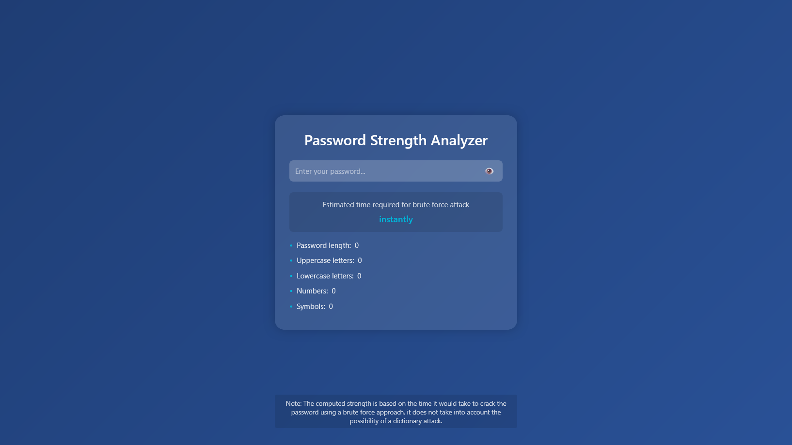

# Password Analyzer

A modern and minimalist web application that analyzes password strength in real-time and estimates the time required to crack it using brute force.

## Features

- **Real-time Analysis**: Instantly analyzes password strength as you type
- **Crack Time Estimation**: Estimates time required to brute force the password
- **Character Composition**: Shows detailed breakdown of password components
  - Password length
  - Uppercase letters count
  - Lowercase letters count
  - Numbers count
  - Symbols count
- **Hide/Show Password**: Toggle password visibility with eye icon
- **Modern Design**: Clean and minimalist interface with glassmorphism effect
- **Responsive Layout**: Works seamlessly on all devices

## How It Works

The analyzer evaluates passwords based on:
1. Length (minimum 8 characters)
2. Presence of uppercase letters
3. Presence of lowercase letters
4. Presence of numbers
5. Presence of special characters

The crack time estimation is calculated based on:
- Character set size (depending on which character types are used)
- Password length
- Assumption of 1 trillion guesses per second (modern GPU capability)

## Technologies Used

- HTML5
- CSS3 (with modern features like glassmorphism)
- JavaScript (ES6)

## Usage

1. Open `index.html` in your browser
2. Type or paste your password in the input field
3. View the real-time analysis:
   - Estimated crack time
   - Character composition breakdown
4. Use the eye icon to toggle password visibility

## Notes

- The crack time estimation is based on brute force attack only
- Dictionary attacks and other sophisticated methods are not considered
- Always use strong, unique passwords for important accounts

## Screenshot

## License

This project is open source and available under the MIT License. 